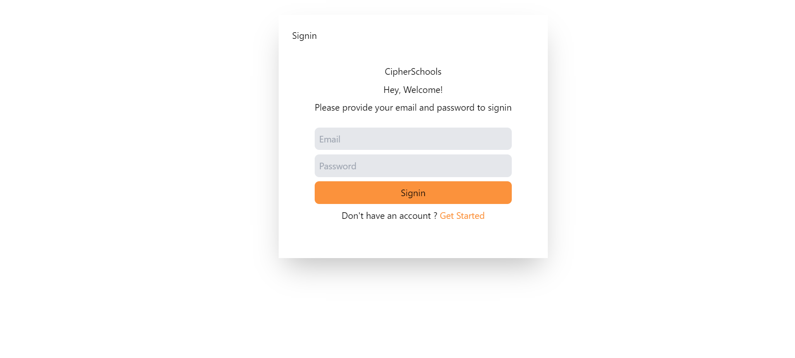
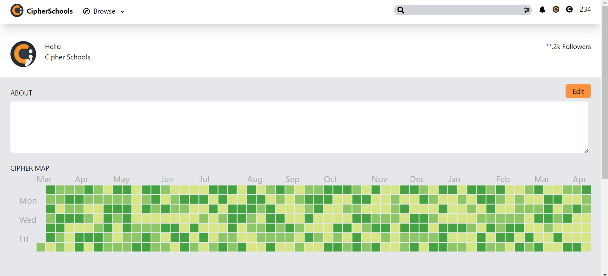
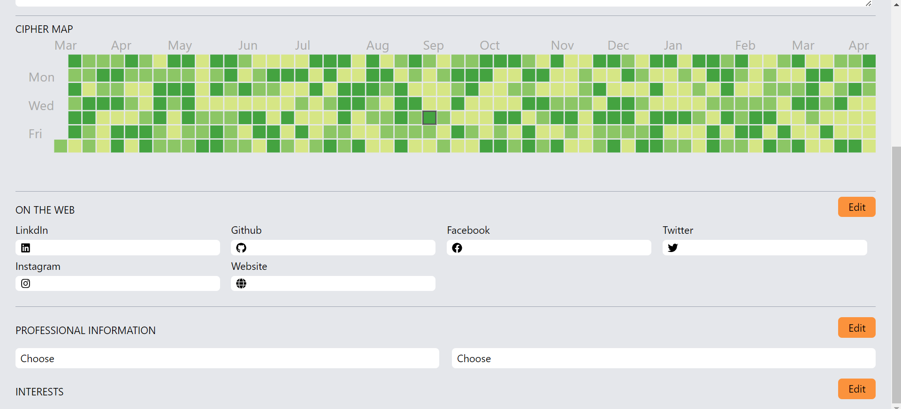

# CipherSchools

## To run the project locally
1. Clone this repo. 
`git clone git@github.com:gaurav-2-0-0-2/CipherSchools.git`
2. Go to frontend and run  
`npm install`
3. After doing this run  
`npm run dev`
This will start the project locally  
4. Now go to the backend directory and run  
`npm install`
5. After installing the modules run  
`node server.js` 

## Glimpse of the project
### Register Page 

### Login Page  

### Profile Page 

## Tasks I have Implemented
1. Registering User 
2. Logging User 
3. Authentication (I used bcrypt to store hashed password)  

## Tasks I have not Implemented
1. Responsiveness 
2. Getting Followers Data 
3. Updating User Profile 

