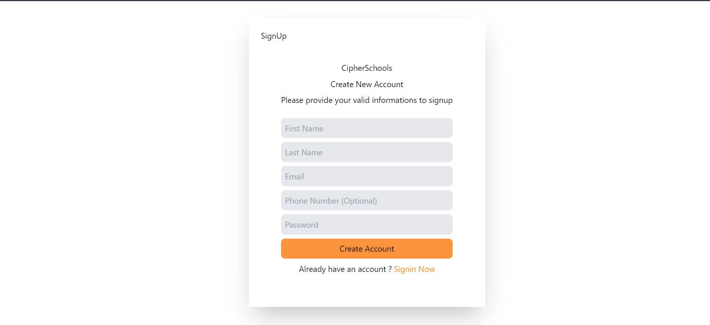

# CipherSchools

## To run the project locally
1. Clone this repo. 
`git clone git@github.com:gaurav-2-0-0-2/CipherSchools.git`
2. Go to frontend and run  
`npm install`
3. After doing this run  
`npm run dev`
This will start the project locally  
4. Now go to the backend directory and run  
`npm install`
5. After installing the modules run  
`node server.js` 

## Glimpse of the project

